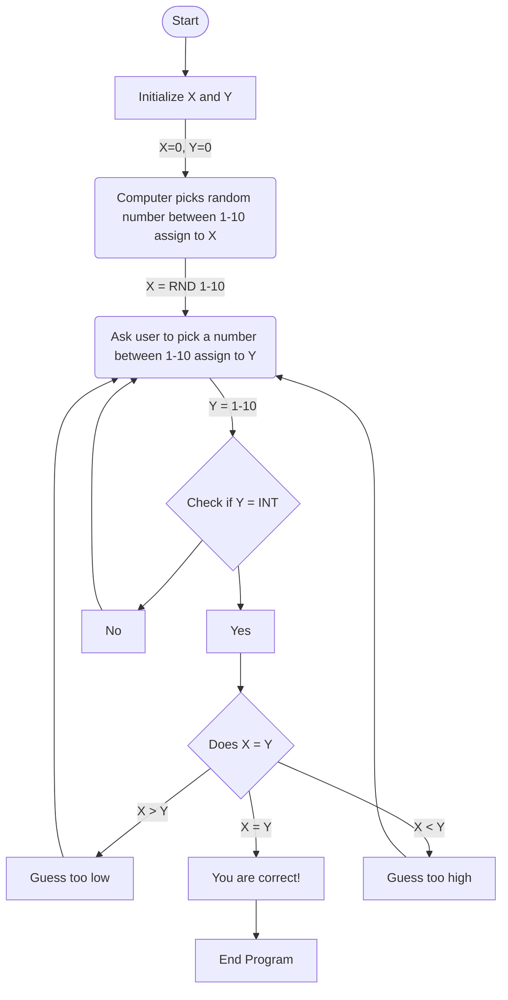

```mermaid
flowchart TD
Start([Start]) -->
    A[Initialize X and Y] -->|X=0, Y=0| B(Computer picks random number between 1-10 assign to X)
    B -->|X = RND 1-10| D(Ask user to pick a number between 1-10 assign to Y) -->|Y = 1-10| E
    E{Check if Y = INT} -->
    F[Yes] -->
    I{Does X = Y} -->|X > Y| J[Guess too low] -->D
    I -->|X = Y| K[You are correct!] --> M[End Program]
    I -->|X < Y| L[Guess too high] -->D
    E -->G[No] --> D
```
