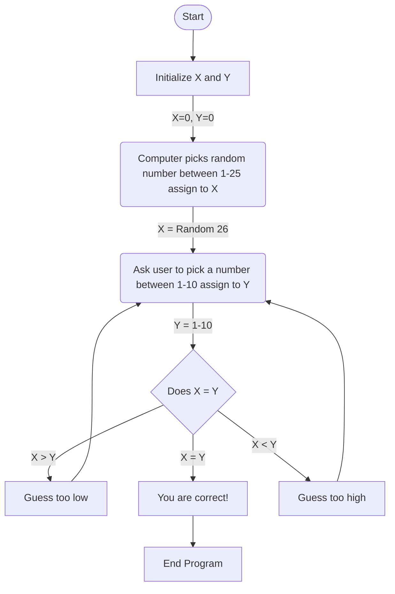

```mermaid
flowchart TD
Start([Start]) -->
    A[Initialize X and Y] -->|X=0, Y=0| B(Computer picks random number between 1-25 assign to X)
    B -->|X = Random 26| C(Ask user to pick a number between 1-10 assign to Y) -->|Y = 1-10| D
    D{Does X = Y} -->|X > Y| J[Guess too low] -->C
    D -->|X = Y| E[You are correct!] --> M[End Program]
    D -->|X < Y| F[Guess too high] -->C
```
